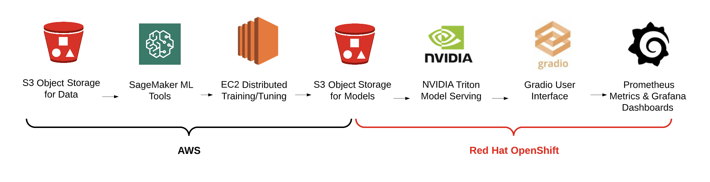
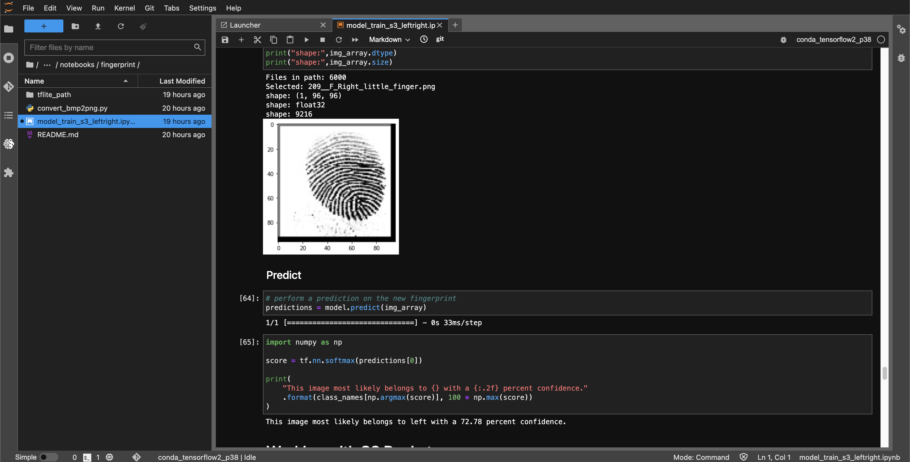
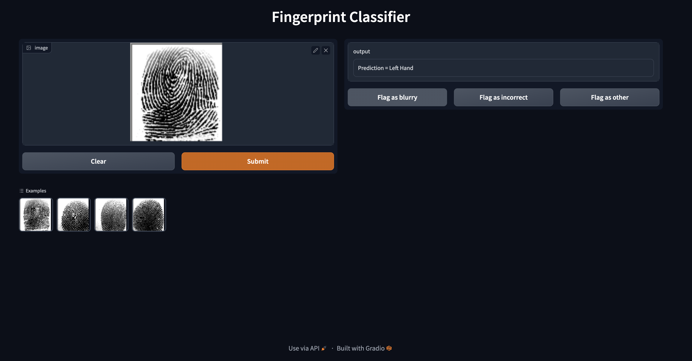

# Fingerprint Prediction on Red Hat OpenShift Container Platform

<!-- Improved compatibility of back to top link: See: https://github.com/othneildrew/Best-README-Template/pull/73 -->
<a name="readme-top"></a>
<!--
*** Thank you for checking out this fingerprint prediction demonstration. If you have a suggestion
*** that would make this better, please fork the repo and create a pull request
*** or simply open an issue with the tag "enhancement".
*** Don't forget to give the project a star!
*** Thanks again! 
-->

<!-- TABLE OF CONTENTS -->
<details>
  <summary>Table of Contents</summary>
  <ol>
    <li>
      <a href="#about-the-project">About The Project</a>
      <ul>
        <li><a href="#about-the-model">About The Model</a></li>
        <li><a href="#built-with">Built With</a></li>
      </ul>
    </li>
    <li>
      <a href="#getting-started">Getting Started</a>
      <ul>
        <li><a href="#prerequisites">Prerequisites</a></li>
        <li><a href="#installation">Installation</a></li>
      </ul>
    </li>
    <li><a href="#usage">Usage</a></li>
    <li><a href="#roadmap">Roadmap</a></li>
    <li><a href="#contributing">Contributing</a></li>
    <li><a href="#license">License</a></li>
    <li><a href="#contact">Contact</a></li>
    <li><a href="#acknowledgments">Acknowledgments</a></li>
  </ol>
</details>

<!-- ABOUT THE PROJECT -->
## The Project



Goal for this demo is to demonstrate the flexible integration of tools to train a model with SageMaker, serve the model on OpenShift using the NVIDIA Triton Inference engine and interact with the model using Gradio.

## Why do this? 

Overall, Data science needs flexibility and IT needs standardization.
- From a development perspective, SageMaker is a robust toolkit that data scientists are familiar with from preparing data and training models.
- From an operational perspective, Red Hat OpenShift is a best-in-class enterprise Kubernetes container platform. It provides a hybrid cloud solution from private data centers to multiple cloud vendors. It makes it easier to build, operate, and scale globally, and on demand, through a familiar management interface.
- Partner and open source software easily extend Red Hat OpenShift for other AI/ML needs:
  - AWS Controller for Kubernetes Operators: IAM, EC2, S3, SageMaker
  - NVIDIA Triton Inference server
  - and the Gradio UI software library


### The Scenario

The scenario we use was to train a model that could predict suspect attributes from an unknown fingerprint.
For example, in the data center or in the field, this model could help down-select possible suspects given an unseen fingerprint.
Since we only had public data, the predictions are basic, but the possibilities are what we intend to inspire.

### The demo

This demo covers several topics across the lifecycle for extending Red Hat OpenShift to perform common
data science tasks from data ingestion to inference monitoring.

Training Notebook             |  Inference UI
:-------------------------:|:-------------------------:
 | 

See the <a href="#getting-started">Getting Started</a> to get started.

### Built With

- [Red Hat OpenShift Self-Managed on AWS](https://www.redhat.com/en/resources/self-managed-openshift-sizing-subscription-guide)
- [AWS SageMaker Notebooks](https://aws.amazon.com/pm/sagemaker/)
- [NVIDIA Triton Inference Server](https://docs.nvidia.com/launchpad/ai/classification-openshift/latest/openshift-classification-triton-overview.html)
- [Gradio User Interface](https://gradio.app/)
- [AWS Controller for Kubernetes Operators](https://operatorhub.io/?provider=%5B%22Amazon%22%5D): IAM, EC2, S3, SageMaker
- [Hardware Acceleration](https://catalog.redhat.com/software/containers/nvidia/gpu-operator/5f9b0279ac3db90370a2128d)

<!-- GETTING STARTED -->
## Getting Started

If you have the demo installed, start in the AWS Console SageMaker Notebooks.
If not, see the <a href="#prerequisites">Prerequisites</a>.

<p align="right">(<a href="#readme-top">back to top</a>)</p>

### Prerequisites

- [x] Red Hat OpenShift Cluster 4.10+
- [x] Cluster admin permissions
- [x] AWS Web Console access
- [x] `oc` cli installed locally
- [x] `python3.x` installed locally
- [x] 'aws-cli' installed locally

<p align="right">(<a href="#readme-top">back to top</a>)</p>

### Installation

```commandline
# From the browser,
# 1. Access the web console and login

# 2. copy your terminal login command and token from the web console.

# From your terminal,
# 3. log into the cluster using oc login (you may need to add --insecure-skip-tls-verify=true)
oc login

# 4. clone in the demo-rosa-sagemaker repo to provision the demo
git clone https://github.com/redhat-na-ssa/demo-rosa-sagemaker.git

# 5. change in to the demo-rosa-sagemaker directory
cd demo-rosa-sagemaker

# 6. run the scripts/bootstrap.sh 
./scripts/bootstrap.sh

# optional
# source ./scripts/bootstrap.sh and run commands individually, i.e.
setup_demo
delete_demo
```

<p align="right">(<a href="#readme-top">back to top</a>)</p>

<!-- USAGE EXAMPLES -->

### Intended Usage

Intended to be run on Red Hat OpenShift Container Platform on AWS (self-managed). Alternatively, Red Hat OpenShift on AWS (managed).
Extend RHOCP with AWS capabilities.

<p align="right">(<a href="#readme-top">back to top</a>)</p>

<!-- ROADMAP -->

## Contributing

<p align="right">(<a href="#readme-top">back to top</a>)</p>

## License

<p align="right">(<a href="#readme-top">back to top</a>)</p>

## Contact

<p align="right">(<a href="#readme-top">back to top</a>)</p>

## Acknowledgements

- [Explore: Fingerprint Data Set](https://github.com/redhat-na-ssa/datasci-fingerprint.git)
- [Best-README-Template](https://github.com/othneildrew/Best-README-Template)
- [Kaggle - Sokoto Coventry Fingerprint Dataset](https://www.kaggle.com/datasets/ruizgara/socofing)
- [TensorFlow Image Classification](https://www.tensorflow.org/tutorials/images/classification#use_tensorflow_lite)
- [TensorFlow Lite Image Classification](https://www.tensorflow.org/lite/models/modify/model_maker/image_classification#simple_end-to-end_example)
