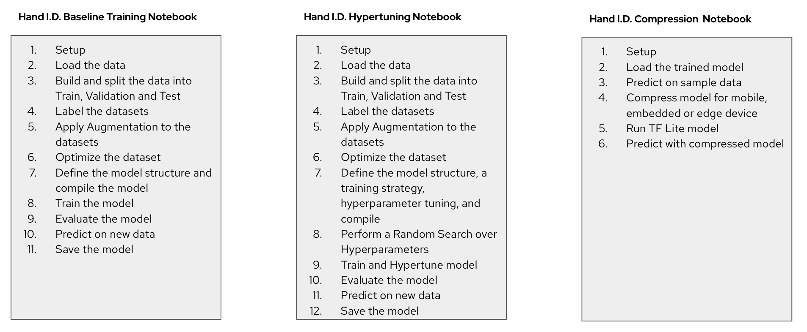
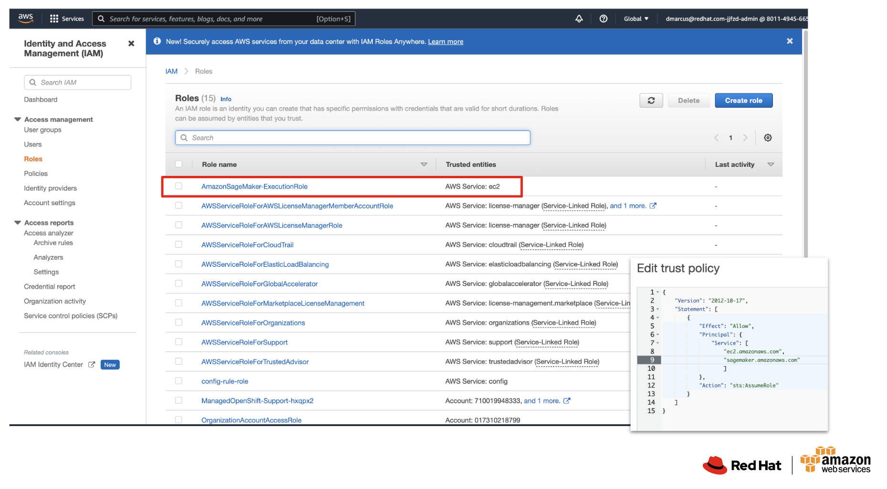
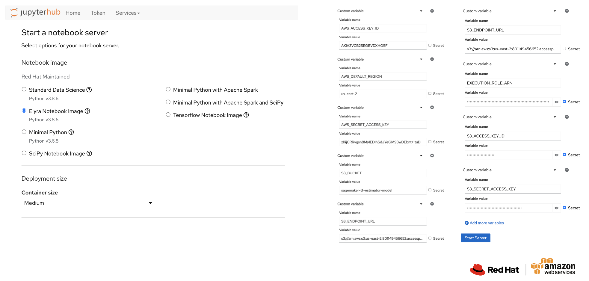

# ROSA running Open Data Hub Operator with SageMaker 
Demonstrate using ROSA to train models with AWS SageMaker SDK. 

# Use Case
The challenge: Can you accurately predict wether a fingerprint comes from a left or right hand?


We will develop a model that predicts with high accuracy whether or not a given fingerprint comes from a left or right hand.

There are 3 notebooks that: 
1. Train a baseline model with default parameters
1. Hypertune a model for greater performance  
1. Compress a model for an embedded device



The model is trained to predict from a given fingerprint if it comes from the left or right hand. The training data and model could also be refactored to predict finger the print is from and gender. Currently, only hand is predicted.


## Setup Operators
Create AWS users (service principles)

NOTICE: Keep output from `aws iam create-access-key`

```
# create s3 user
aws iam create-user --user-name ack-user-s3
aws iam create-access-key --user-name ack-user-s3

# create sagemaker user
aws iam create-user --user-name ack-user-sagemaker
aws iam create-access-key --user-name ack-user-sagemaker
```

Assign Amazon Resource Name (ARN) policy to users.
```
# https://github.com/aws-controllers-k8s/s3-controller/blob/main/config/iam/recommended-policy-arn

# attach user policy - s3
aws iam attach-user-policy \
    --user-name ack-user-s3 \
    --policy-arn 'arn:aws:iam::aws:policy/AmazonS3FullAccess'

# attach user policy - sagemaker
aws iam attach-user-policy \
    --user-name ack-user-sagemaker \
    --policy-arn 'arn:aws:iam::aws:policy/AmazonS3FullAccess'

aws iam attach-user-policy \
    --user-name ack-user-sagemaker \
    --policy-arn  'arn:aws:iam::aws:policy/AmazonEC2FullAccess'

aws iam attach-user-policy \
    --user-name ack-user-sagemaker \
    --policy-arn  'arn:aws:iam::aws:policy/AmazonSageMakerFullAccess'

```

Use `oc apply -k` to install operators

```
# install ack-s3-controller
oc apply -k openshift/ack-s3-controller/operator/overlays/alpha

# install ack-sagemaker-controller
oc apply -k openshift/ack-sagemaker-controller/operator/overlays/alpha
```

Use output from `aws iam create-access-key` to update values `AWS_ACCESS_KEY_ID` and `AWS_SECRET_ACCESS_KEY` in the `ack-system` namespace:
- ack-s3-user-secrets
- ack-sagemaker-user-secrets

## Setup Custom Notebooks

```
oc apply -f openshift/sagemaker-notebook
```


## Examples

TODO

[examples](openshift/examples)

[sagemaker - examples](https://github.com/aws-controllers-k8s/sagemaker-controller/tree/main/samples)


## Overview of this solution stack:
This basic demonstration requires configuring the environment manually, ingesting data from S3, training a basic TensorFlow Estimator model in a Jupyter notebook using SageMaker SDK. It versions and stores the trained model in S3. This is possible because the SageMaker SDK leverages an IAM Execution Roles to securely control access to AWS SageMaker resources and S3 storage for the data and model.

## Why use SageMaker SDK on ROSA?
Simply, Use the best tools for the job. SageMaker is a best-in-class toolkit for machine learning that requires AWS resources to build models. OpenShift is best-in-class hybrid cloud container platform that can run containers the same way from cloud down to compact edge clusters. Containers can go futher down to edge devices.
- [SageMaker Python SDK](https://sagemaker.readthedocs.io/en/stable/index.html) provides integrated solutions beyond what is available with Red Hat products today.
    - [Frameworks](https://sagemaker.readthedocs.io/en/stable/frameworks/index.html) Apache MXNet, Chainer, Hugging Face, PyTorch, Reinforcement Learning, Scikit-Learn, SparkML Serving, Tensorflow, XGBoost
    - [Built-in Algorithms](https://sagemaker.readthedocs.io/en/stable/algorithms/index.html) Estimators, Tabular, Text, Time-series, Unsupervised, Vision
    - [Workflows] Airflow workflows, AWS Step Functions, SageMaker Pipelines, SageMaker Lineage
    - [Debugger](https://sagemaker.readthedocs.io/en/stable/amazon_sagemaker_debugger.html) 
    - [Feature Store](https://sagemaker.readthedocs.io/en/stable/amazon_sagemaker_featurestore.html)
    - [Data pre and post processing](https://sagemaker.readthedocs.io/en/stable/amazon_sagemaker_processing.html)
    - [Model Build CI/CD](https://sagemaker.readthedocs.io/en/stable/amazon_sagemaker_model_building_pipeline.html)
- [ROSA](https://aws.amazon.com/rosa/) Take advantage of integrated AWS cloud services such as compute, storage, networking, database, analytics, and machine learning, which are directly accessible via Red Hat OpenShift Service on AWS. This makes it easier to build, operate, and scale globally on demand through a familiar management interface. With ROSA many of the security responsibilities that customers take on, can be managed by Red Hat:
    - Encryption.
    - Firewall and network configurations.
    - Identity and Access Management.
    - Patching and updating software.
    - Securing the Linux Operating System

## Explanation of components.
- [Amazon SageMaker Python SDK](https://sagemaker.readthedocs.io/en/stable/) is an open source library for training and deploying machine-learned models on Amazon SageMaker.
- [AWS S3 Storage](https://aws.amazon.com/pm/serv-s3/) Object storage built to store and retrieve any amount of data from anywhere.
- [Red Hat OpenShift Service on AWS](https://aws.amazon.com/rosa/) is a managed Red Hat OpenShift service deployed and operated on AWS that allows customers to quickly and easily build, deploy, and manage Kubernetes applications on a turnkey application platform in AWS Cloud. As a native AWS service, Red Hat OpenShift Service on AWS can be accessed on-demand from the AWS console with hourly billing, a single invoice for AWS deployments, integration with other AWS cloud-native services, and joint support from Red Hat and AWS. 
- [Open Data Hub](https://github.com/opendatahub-io) an open source project based on Kubeflow that provides open source AI tools for running large and distributed AI workloads on OpenShift Container Platform. 

## Wiring things up? 
1. You need access to a [ROSA Cluster](https://cloud.redhat.com/blog/red-hat-openshift-service-on-aws-is-now-generally-available) with cluster-admin privileges in an available region [See Regions](https://docs.openshift.com/rosa/rosa_architecture/rosa_policy_service_definition/rosa-service-definition.html#rosa-sdpolicy-regions-az_rosa-service-definition).
1. Your region needs to have SageMaker in the [available services](https://aws.amazon.com/about-aws/global-infrastructure/regional-product-services/).
1. You need access to the AWS Console to create an IAM Execution role for [Amazon SageMaker Python SDK](https://sagemaker.readthedocs.io/en/stable/). [How to create an IAM Execution role](https://docs.aws.amazon.com/sagemaker/latest/dg/sagemaker-roles.html#sagemaker-roles-create-execution-role). 
1. If not done by default, you need to add 'sagemaker.amazonaws.com' to the ExecutionRole Trust policy. 

1. You need an AWS S3 Storage Bucket with 'sagemaker' in the name and an Access Point. [How to create an S3 Storage Bucket with an Access Point]().
1. You need to deploy the ODH Operator in the namespace with 4 components: ODH Dashboard, JupyterHub, Jupyter Notebooks and ODH common. [How to deploy the Open Data Hub Operator]().
1. You need a ROSA Project (or namespace). [How to create a project, add team members, set limits and quotas]().
1. Prior to launching a Jupyter Notebook, update the Jupyter Notebook Environment Variables :


```
AWS_ACCESS_KEY_ID=<update>
AWS_DEFAULT_REGION=<update>
AWS_SECRET_ACCESS_KEY=<update>
EXECUTION_ROLE_ARN=arn:aws:iam::<update>:role/AmazonSageMaker-ExecutionRole
S3_BUCKET=<update>
S3_ENDPOINT_URL=<update>
```
The notebook = ODH_SageMaker_SDK.ipynb

# Links
- [Sagemaker lifecycle config examples](https://github.com/aws-samples/amazon-sagemaker-notebook-instance-lifecycle-config-samples)

# Bugs

## Error
Issue with ACK operator deployments not using specific selectors to select pods for a specific deployment. You see all pods associated with all deployments

```
kind: Deployment
apiVersion: apps/v1
...

spec:
  selector:
    matchLabels:
      control-plane: controller
  template:
    metadata:
      labels:
        control-plane: controller
```

## Recommendation

Label `control-plane: controller` needs to be more specific

Use: `control-plane: sagemaker-controller`
