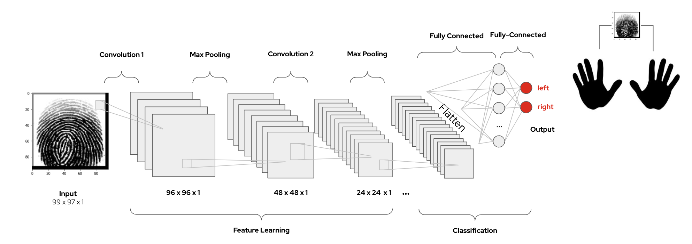

## About The Data
Sokoto Coventry Fingerprint Dataset (SOCOFing) is a biometric fingerprint database 
designed for academic research purposes. 

Please see the accompanying [GitHub](https://github.com/redhat-na-ssa/demo-rosa-sagemaker-data) 
that pulls the data from [Kaggle](https://www.kaggle.com/datasets/ruizgara/socofing).

For a complete formal description and usage policy please refer to the following 
[paper](https://arxiv.org/abs/1807.10609).

## Model Development and Training

The model in the notebook is trained to predict from a given fingerprint if it comes from the:
- hand: left or right 

It could be easily adapted to predict:
- gender: male or female
- finger: index, middle, ring, little, or thumb

This notebook demonstrates:
- development with JupyterLab Notebook on Red Hat OpenShift 
- data and model ingestion and storage from storage with AWS S3 (or Local storage)
- data preprocessing (Label, Split, Augment, Optimize) with Keras
- model build from scratch with Keras Models
- distributed model training strategies (One Device, Mutli-Worker, Mirrored Multi-Worker, Acceleration)
- hyperparameter tuning (RandomSearch, Hyperband, BayesianOptimization, Sklearn)
- model saving and compression with TensorFlow Lite

From AWS S3 storage:
- model serving and inferencing with NVIDIA Triton and Gradio
- inference monitoring with Prometheus and Grafana