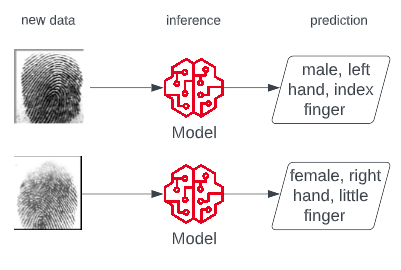

## Fingerprint prediction

The basic idea came from a Kaggle competition and the [Sokoto Coventry Fingerprint Dataset](https://www.kaggle.com/datasets/ruizgara/socofing). The goal is to train a model that can predict the gender, hand and finger from a fingerprint.

